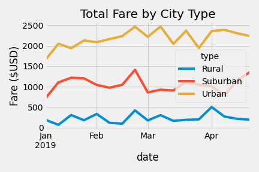
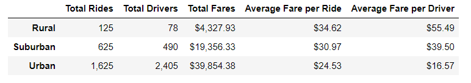

# PyBer_Analysis

 
## Overview of the Analysis
V. Isualize, the CEO of PyBer, has tasked Omar and me with conducting an analysis of their ride data. She has asked that we look at the total fare by city type and graph it for our analysis. Using pandas and matplotlib, we did an analysis of the data using pandas and then graphed it with matplotlib in Python's Jupiter Notebooks.
## Results

## Summary
